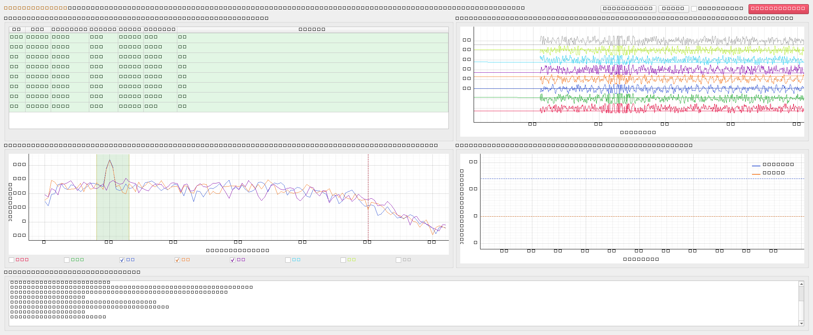
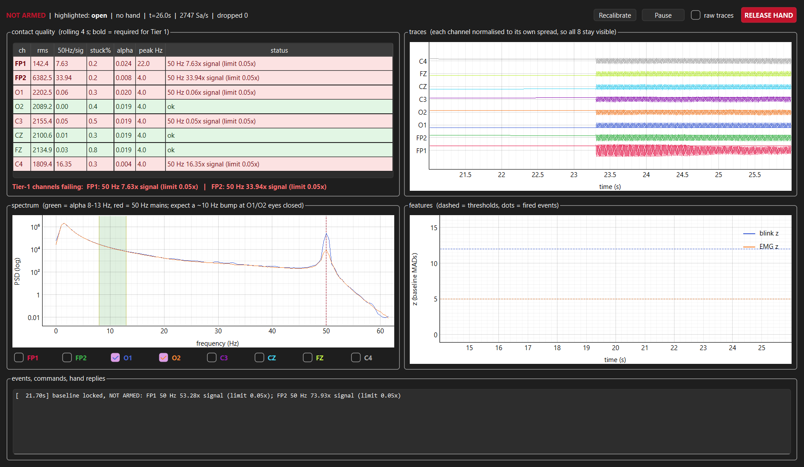

# NeuroHand — EEG-Based Prosthetic Control System

Control a tendon-driven robotic hand from an 8-channel EEG cap. A biosignal gesture
selects a discrete grasp primitive; the hand firmware executes it.

**Status.** The full control path is built and tested end to end offline: EEG → causal
filters → gesture detection → command → serial → ESP32 firmware, plus a live GUI
monitor and a self-scoring cued protocol. It has not yet driven a hand.

On real EEG so far:

- **Jaw clench works.** 5/5 cued clenches detected, the block autocorrelating at
  r = 0.485 on a 3.98 s lag against the intended 4 s spacing.
- **Blinks are not reaching the frontal electrodes.** Zero detections at any threshold
  from z = 12 down to z = 4, with nothing rejected by any gate. The cause looks
  positional rather than numerical — see [Where it stands](#where-it-stands).
- **Occipital alpha is achievable.** A clean 8.5 Hz rhythm with an eyes-closed /
  eyes-open ratio of 2.65–3.49 against a >1.5 target.

Everything below runs today without the cap and without the hand.

- [docs/DESIGN.md](docs/DESIGN.md) — every signal-chain decision and the measurement
  that forced it. Read this before changing the detector.
- [PROJECT_NOTES.md](PROJECT_NOTES.md) — lab notebook: hardware, data access, session log.
- [reports/](reports/) — per-session analysis.

---

## Hardware

| part | detail |
|---|---|
| EEG | Qneuro H100 "NeuroState" cap — 8 ch, 24-bit, 250 Hz, order `FP1 FP2 O1 O2 C3 CZ FZ C4` |
| reference | earlobe clip; PPG on the other earlobe |
| also on cap | PPG (R + IR, 100 Hz), IMU (quaternion + accel, 100 Hz) |
| link | Bluetooth (BLE serial style), device `NeuroState-XXXX` |
| hand | 8× N20 micro DC gearmotors, tendon-driven fingers |
| drivers | 4× DRV8833 (2 H-bridges each) |
| MCU | ESP32 — 16 LEDC PWM channels, exactly enough for 8 motors |
| power | stall ~0.7–1.6 A per motor → 2S LiPo + 6 V buck ≥5 A. Not USB. |

There is no vendor SDK and no BLE protocol documentation, so EEG is taken over **LSL**
(live) or **CSV** (saved sessions) rather than by reverse-engineering BLE.

Amplitudes are raw device counts, not microvolts — gain is configurable and the scale
undocumented, so every threshold is expressed in baseline MAD units.

## Architecture

```
cap --BLE--> NeuroAnalytics (STREAMING-LSL) --LSL--> Python --serial--> ESP32 --PWM--> 4x DRV8833 --> 8x N20
                                                        |                  ^
                                                   quality gate       watchdog: coast on link loss
```

| module | role |
|---|---|
| `neuro/source.py` | EEG input: live LSL, CSV session replay, or synthetic with scripted gestures |
| `neuro/dsp.py` | causal streaming filters (state carried across chunks), ring buffer, robust baseline |
| `neuro/quality.py` | contact metrics and the arm/refuse decision |
| `neuro/detect.py` | Tier-1 gesture detection: blink, held blink, jaw clench |
| `neuro/decide.py` | gestures → hand commands (select-then-confirm) |
| `neuro/protocol.py` | cue schedule and scoring |
| `neuro/hand.py` | serial line protocol, heartbeat, in-process mock |
| `firmware/esp32_hand/` | ESP32 firmware; owns the grasp primitives |
| `config/hand.json` | single source of truth for pins, motor map, timings |
| `run_monitor.py` | live GUI monitor and electrode-contact tool |
| `run_protocol.py` | cued gesture session that records and scores itself |
| `run_tier1.py` | headless runner: gestures → hand |
| `tools/` | session analysis, LSL probe, config generator |

## Quickstart

```bash
pip install -r requirements.txt

# nothing attached: synthetic gestures through a mock hand
python run_tier1.py --source synth --mock --calib 6 --duration 30

# replay a recorded session
python run_tier1.py --source "<...>/LiveSession/09-33-34" --mock --calib 20

# live: app in STREAMING-LSL mode, ESP32 on COM5
python tools/lsl_probe.py                      # confirm stream names first
python run_tier1.py --source lsl --port COM5

# validate everything
python tests/test_chain.py
python tests/test_monitor.py     # GUI, runs headless
python tests/test_protocol.py
```

## Recording a session

**Check contact first — it takes ten seconds and has saved whole recordings.** Contact
demonstrably regresses between sessions: two recordings 20 minutes apart differed by
1000× in mains, and one of them was unusable.

```bash
python run_monitor.py --source lsl --stream jyotishman_EEG
```

Three things must be true before recording:

1. `50Hz/sig` under ~0.05 on FP1 and FP2.
2. Blink hard three times — the blink-z trace must tower over the dashed threshold.
3. Close your eyes 10 s — an 8–10 Hz bump must appear at O1/O2 in the spectrum.

Then run the cued session, which issues the cues, records when it issued them, and
writes a scored report to `reports/`:

```bash
python run_protocol.py --stream jyotishman_EEG
```

Default schedule, 115 s: 20 s rest (the baseline — stay still, do not blink),
10 blinks at 3 s, 10 s rest, 5 held blinks at 4 s, 10 s rest, 5 jaw clenches at 4 s.

Do not time gestures by hand. Three recordings were lost that way; a 300 ms blink
cannot be located inside a 95 s file from memory.

## GUI monitor / contact tool

With no `--port` or `--mock` it attaches no hand at all, which is the intended way to
use it while adjusting electrode pads.



- **contact quality** — per-channel rms, 50 Hz-to-signal ratio, stuck samples, alpha
  share and peak frequency, on a rolling 4 s window. Rows go red with the specific
  complaint. Computed independently of the detector, so it is live from the first
  second rather than waiting for calibration. `FP1`/`FP2` are bold because Tier 1
  needs only those two.
- **traces** — all 8 channels, each normalised to its own spread. A shared scale is
  useless here: `FP2` has run 11× `FP1`'s amplitude in one recording. Toggle
  `raw traces` to see drift and mains as the amplifier sees them.
- **spectrum** — alpha band shaded, 50 Hz marked. The eyes-closed Berger check, live.
- **features** — blink and EMG z-scores against their thresholds, with fired events
  dotted. This pane explains a *missed* gesture: you can see whether it fell short of
  threshold, was rejected by a gate, or was never detected at all.

`Recalibrate` re-learns the baseline after fixing a pad. `RELEASE HAND` is an operator
abort, live whether or not the detector is armed.

Bad contact looks like this — session `09-57-47`, refusing to arm:



## Control model

| gesture | command | effect |
|---|---|---|
| short blink | `CYCLE` | advance the highlighted grasp primitive |
| held blink (≥0.42 s) | `CONFIRM` | execute the highlighted primitive |
| jaw clench | `RELEASE` | open the hand now, cancel everything |

Primitives: `open`, `power`, `pinch`, `point`, `tripod`.

No single misdetection can actuate the hand — a stray blink only moves a highlight. The
one gesture that always acts is the most deliberate, and it acts in the safe direction.

Tier 1 is first because it survives poor electrode contact: a blink is an EOG dipole
roughly 10× larger than cortical EEG and a jaw clench is EMG larger still, so both work
off `FP1`/`FP2` alone while the occipital and central pads are still being fought with.
Per-finger intent is *not* recoverable from scalp EEG, which is why the firmware and
not the classifier owns the primitives.

Roadmap: **1** blink/jaw (built) → **2** SSVEP (O1/O2, FFT/CCA) → **3** alpha level →
**4** motor imagery (C3/C4/CZ, CSP+LDA or Riemannian) → **5** hybrid.

Why a held blink rather than a double blink, and every other non-obvious choice:
[docs/DESIGN.md](docs/DESIGN.md).

## Safety

Pull-only tendons with no position feedback in the base N20 build, so a motor left
energised stalls against its tendon and burns.

1. **Watchdog.** No serial line for 1.5 s → every channel coasts, hand reported open.
   Heartbeats alone cannot re-arm a tripped watchdog; an explicit command is required.
2. **Bounded actuation.** Every move carries a per-motor deadline from
   `config/hand.json`. A motor cannot physically be driven longer than its limit.
3. **Duty ramp.** Duty rises over 80 ms — 8 stalling N20s can pull well over 10 A.
4. **Boot coasted.** A brownout reset mid-grip must not resume pulling.
5. **Quality gate.** The detector refuses to arm on bad contact, so noise cannot reach
   the motors. Ungated, one noise-only recording produced 10 motor commands in 181 s.
6. **Busy lockout.** Gestures made while tendons are moving are dropped, not queued.

## Where it stands

Jaw clenches come through on FP1/FP2 while blinks do not — on the same electrodes, in
the same recording. That asymmetry is the diagnosis: jaw is read from the 25–110 Hz EMG
band, which couples through mediocre skin contact, whereas a blink is a slow EOG dipole
that needs the pad near the eye. Pads riding up toward the hairline keep the EMG and
lose the dipole.

So the next step is positional, not numerical: move `FP1`/`FP2` low on the forehead,
~1–2 cm above the eyebrows, and verify with a live blink before recording. Every
attempt to recover the blinks by tuning — dropping `blink_z` to 4, adding high-pass
corners at 0.3/0.5/0.8 Hz — failed, which is what rules out a software cause.

The six posterior pads also keep floating (r ≈ 1.00 with one another at ~10× frontal
amplitude). They are not needed for Tier 1, but they are the reference the artifact
gate compares against, and they are required for tiers 3–5.

## Hardware questions still open

`config/hand.json` holds placeholders so these stay parameters rather than blockers:
finger→motor map, encoder variant yes/no, motor voltage rating, which driver boards are
owned, and tendon return method. Pin choices avoid GPIO 6–11 (flash), 34–39
(input-only) and 0/2/15 (strapping); GPIO 16/17 are consumed by PSRAM on WROVER
modules, so remap motors 4/5 there.

Edit the JSON, then regenerate the firmware header — the tests assert the two agree:

```bash
python tools/gen_hand_config.py
```

## Not in this repo

- **Screen recordings** (`*.mp4`, 333 MB) and extracted `frames/` — one file alone
  exceeds GitHub's 100 MB limit.
- **`NeuroAnalyticsWindows_28-05-2026/`** — Qneuro's licensed Unity application and
  manual. Vendor proprietary; obtain from Qneuro India Pvt. Ltd. (support@qneuro.com).
  `tools/assembly_userstrings.txt`, a string dump from its DLL, is excluded for the
  same reason.
- **Recorded sessions** — under
  `%LOCALAPPDATA%Low/Qneuro/QneuroNeuroAnalytics/<user>/<date>/LiveSession/<time>/`.
